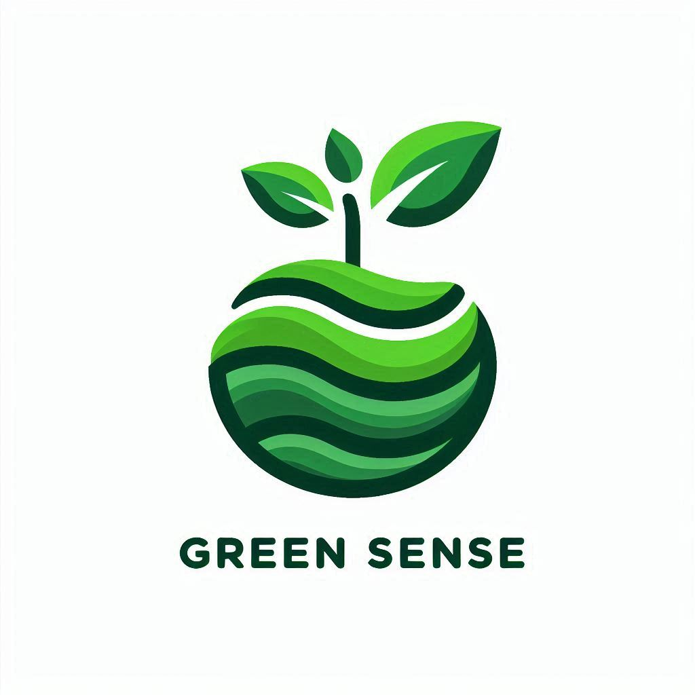

# Green Sense



> Every green seed of awareness grows a brighter future

Green Sense is a Flutter application designed to promote environmental awareness.

## 🚀 Getting Started

To get started with the Green Sense app, follow these simple steps:

### Prerequisites

Make sure you have Flutter installed on your machine. For installation instructions, see the [official Flutter documentation](https://flutter.dev/docs/get-started/install).

### Installation

1. **Clone the repository:**
   ```bash
   git clone https://github.com/your-username/green_sense.git
   ```
2. **Navigate to the project directory:**
   ```bash
   cd green_sense
   ```
3. **Install dependencies:**
   ```bash
   flutter pub get
   ```

### Running the App

Once the dependencies are installed, you can run the app on your preferred device or emulator:

```bash
flutter run
```

This will launch the Green Sense app on your connected device or simulator.

## Features

- **Environmental Tips:** Get daily tips on how to live a more sustainable lifestyle.
- **Resource Locator:** Find nearby recycling centers and eco-friendly stores.
- **Community Forum:** Connect with other eco-conscious individuals and share ideas.

## Contributing

Contributions are welcome! If you have any ideas, suggestions, or bug reports, please open an issue or submit a pull request.

## License

This project is licensed under the MIT License - see the [LICENSE.md](LICENSE.md) file for details.